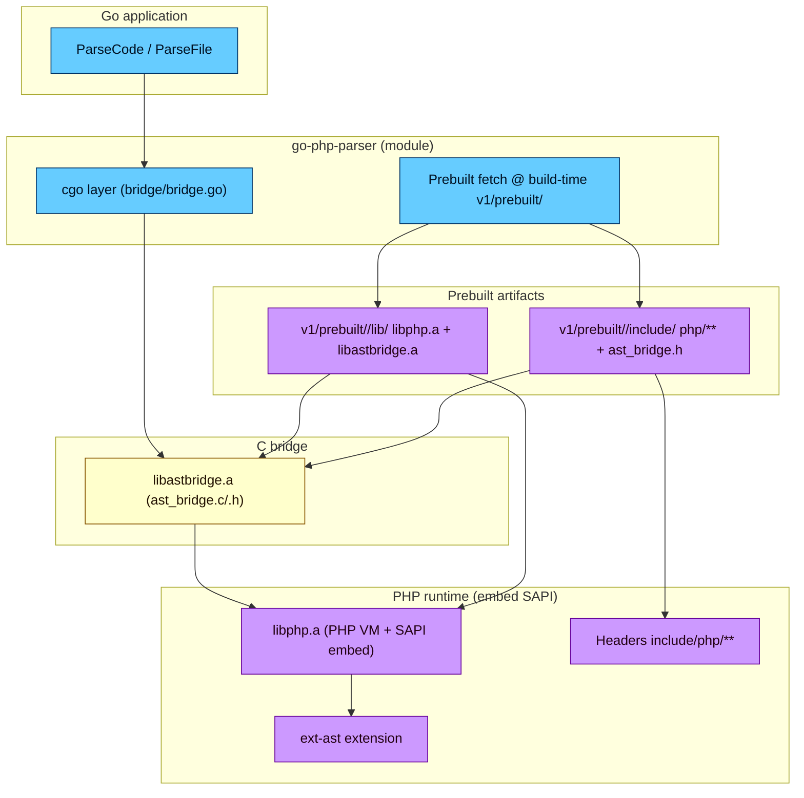

```mermaid
flowchart TD
    subgraph Go_App["Go application"]
      A["ParseCode / ParseFile"]
    end

    subgraph Go_Lib["go-php-parser (module)"]
      B["cgo layer (bridge/bridge.go)"]
      C["Prebuilt fetch @ build-time v1/prebuilt/<target>"]
    end

    subgraph C_Bridge["C bridge"]
      D["libastbridge.a (ast_bridge.c/.h)"]
    end

    subgraph PHP_Embed["PHP runtime (embed SAPI)"]
      E["libphp.a (PHP VM + SAPI embed)"]
      F["ext-ast extension"]
      G["Headers include/php/**"]
    end

    subgraph Build_Artifacts["Prebuilt artifacts"]
      H["v1/prebuilt/<target>/lib/ libphp.a + libastbridge.a"]
      I["v1/prebuilt/<target>/include/ php/** + ast_bridge.h"]
    end

    A --> B --> D --> E
    E --> F
    C --> H
    C --> I
    H --> D
    H --> E
    I --> D
    I --> G

    classDef go fill:#6cf,stroke:#036,stroke-width:1px,color:#012;
    classDef c fill:#ffc,stroke:#850,stroke-width:1px,color:#210;
    classDef php fill:#c9f,stroke:#609,stroke-width:1px,color:#201;
    class A,B,C go
    class D c
    class E,F,G,H,I php
```